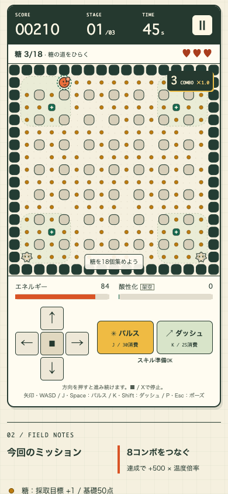

# SHUBO RUN — GitHub管理版

- **遊ぶ：https://toraikura.github.io/shubo-run/**
- **ソース：https://github.com/Toraikura/shubo-run**
- **管理・引き継ぎ：[docs/HANDOFF.md](docs/HANDOFF.md)**
- 別ゲーム：[SAKE CLASH](https://toraikura.github.io/sake-clash/) / [ソース](https://github.com/Toraikura/sake-clash)



# SAT / SHUBO RUN（酒母ラン）

SATの酒母テーマを使った、3ステージ・アーケード。元サイト・GitHub Pages・gh-pagesから独立しています。登録・課金・広告・解析SDK・外部DB・自動外部送信はありません。画像・フォントを含むゲーム資産はローカル配信です。出典リンクだけは利用者が開くと外部サイトへ移動します。

## 起動

```sh
cd shubo-run
npm ci
npm run build
npm run preview
```

開くURL： **http://127.0.0.1:4187/**

開発中は `npm run dev`（同じポートなのでpreviewとの同時起動は不可）。Node.js 22.13以降を推奨。子フォルダ内に独自のpackage.json / package-lock.json / node_modulesを持ち、親のインストールや設定を変更しません。出力は `dist/` の静的3ファイル。GitHub Actionsが検証後、GitHub Pagesへ公開します。file://で直接開くのではなくHTTPプレビューを使用してください。

## 遊び方

1. 「低め・中間・高め」とプレイスタイルを選び、プレイ開始。
2. 矢印 / WASD、または画面下の方向ボタンで移動。押すと進み続け、曲がれない方向の入力は次に曲がれる場所まで保持。■ / Xで停止。
3. 糖を18 → 24 → 30個集めて、3ステージを突破。制限時間は45 / 50 / 55秒。緑の粒は糖の目標数に含まれません。
4. J / Space / パルスで近くの競合を3.2秒停止。K / Shift / ダッシュで約1秒、1.65倍速・接触無効。
5. ハート3つがなくなるか、時間切れで失敗。同じコースで再挑戦、または別の番号・設定を選んで繰り返します。

P / EscまたはⅡでポーズ。タブ非表示、ウィンドウのフォーカス喪失、盤面全体が画面外になった場合も停止し、復帰時は手動再開です。ポーズから終了したプレイはハイスコアに残りません。キー操作はゲーム画面にフォーカスがある状態を基本とします。入力欄・select中はゲームキーを奪いません。

## 温度の違い：すべて架空のゲーム係数

実際の醸造温度・日程ではなく、**ゲーム内の相対環境**です。℃は設定・表示していません。

| 変数 | 低め | 中間 | 高め |
|---|---:|---:|---:|
| 移動1マス（秒） | 0.19 | 0.15 | 0.115 |
| 競合の基本移動1マス（秒） | 0.56 | 0.40 | 0.29 |
| 競合の初期数 | 2 | 3 | 4 |
| 糖の基本配置密度 | 70% | 86% | 100% |
| 消費済み区画への糖補充（秒） | 3.8 | 2.7 | 1.8 |
| 酸性化ゲージ増加 / 秒 | 1.7 | 1.0 | 0.45 |
| エネルギー自然回復 / 秒 | 2.8 | 2.2 | 1.5 |
| スキル共通クールダウン（秒） | 3 | 4 | 5 |
| 得点倍率 | ×1.0 | ×1.4 | ×2.0 |
| 基本コンボ猶予（秒） | 4.5 | 3.5 | 2.8 |

- 低め：敵が遅く回復も速い。糖が少ないため、空いた道を避けるルート設計が効きます。緑区画の減速を利用しやすい設定です。
- 中間：密な糖の道をつなぎ、コンボを維持するプレイ。
- 高め：移動と採取のテンポは速い一方、競合が多く回復が遅い。接近採取とスキルの温存でリスクを選びます。
- 第2・第3ステージは仕切りが変わり、競合速度が上がります。第3ステージは競合がさらに1体増えます（最大5）。
- 採取家：コンボ猶予+1秒、1粒のエネルギー+8、パルス消費40・射程4マス。
- 突破役：1粒のエネルギー+6、パルス消費30・射程5マス。
- 両スタイルともダッシュは25消費。スキルはクールダウンを共有。次ステージ開始時にエネルギー+25、スキル回復。
- 緑の粒はゲージ+18。60以上で緑区画の競合の移動間隔が1.6倍。pHや実際の酸度・微生物制御を表しません。

## 得点・やり込み

糖50点、大粒180点、緑70点。5コンボごとに倍率+0.5（最大×2.5）。停止していない競合が2マス以内の採取はニアミス倍率×1.5。温度倍率も重ねます。パルスで停止させると1体90点×温度倍率。

ステージごとの追加ミッションは「8コンボ」「緑2個」「無傷」。達成で500点×温度倍率、通過時は残り1秒あたり10点×温度倍率。ランクSは全ミッション＋無傷の踏破、Aは2ミッション以上の踏破、Bは踏破、Cは途中終了です。

温度別ハイスコア、6つの実績、終了回数を `localStorage['sat-shubo-arcade:v1']` に保存。データ破損・保存禁止・容量不足でも遊べます。オンラインランキングではないためローカル記録の改変防止は目的にしていません。ブラウザのサイトデータ削除で初期化できます。

コース番号から配置・補充を決定します。同じ番号、温度、スタイル、固定ステップ上の操作履歴なら同じ結果です。同じコースの再挑戦は記録した操作の自動再生ではありません。

## 科学境界

`src/science.ts` に出典で確認した説明、教育用簡略化、架空の係数を別分類として定義。UIの「遊びと科学の、境界線」で確認できます。`src/model.ts` のゲーム係数は出典付き事実から計算していません。

- [酒類総合研究所「清酒」生酛（山廃）系酒母とは](https://www.nrib.go.jp/sake/sakefaq02.html)：酒母の役割、生酛系と速醸系の乳酸の獲得方法。
- [酒類総合研究所「エヌリブ16号」3頁](https://www.nrib.go.jp/sake/nrib/pdf/NRIBNo16.pdf)：醪の糖化とアルコール発酵。

いずれも2026-09-07に該当箇所を確認。酵母がキャラクターのように歩いて糖を食べること、競合を攻撃することは現実の微生物挙動の再現ではありません。**このゲームは仕込み・飲用可否・菌数・酒質を判定しない。**

## 検証

```sh
npm run lint
npm run typecheck
npm test
npm run build
npm run test:e2e
```

E2Eはビルド済みdistをHTTP配信してPlaywrightで操作します。先に `npx playwright install --with-deps chromium` を実行してください。既存Chromeは `PLAYWRIGHT_EXECUTABLE_PATH` で指定できます。

最終結果・検証範囲は [docs/VALIDATION.md](docs/VALIDATION.md)。画面証拠は `docs/screenshots/`、機械レポートは `playwright-report/` と `test-results/`。時間を進めるE2Eでもゲーム状態への代入、勝利フラグ注入、隠しクリアボタンは使用しません。描画された座標と壁・糖・競合を読み、実際のキー／タッチ入力で攻略します。

## 将来の統合ポイント（今回は未実施）

最小の接続は元SATの「酒母で遊ぶ」から、このゲームの公開先へのリンクです。埋め込みなら独立iframe＋適切なtitleを使用。iframeと元サイト間のメッセージ送受信は未実装です。統合時に同一オリジンや保存領域、iframe外のスクロールによる非表示をあらためて確認してください。

Reactへの取り込みは `src/main.tsx` のAppをコンポーネントとして切り出し、CSSをスコープ化して元の `components/shubo-game.tsx` 側から接続します。純粋なルールの変更箇所は `src/model.ts` のMODES / WAVES、科学説明は `src/science.ts`、保存は `src/storage.ts` です。既存 `game/model.ts` の72秒シミュレーションとは混ぜません。

Viteの `base: './'` により生成資産は相対参照。将来のサブパス配信は公開先で再E2Eを行い、配布対象をdistだけに限定してください。親サイトは変更せず、このゲーム専用のGitHub Pagesへ公開します。
